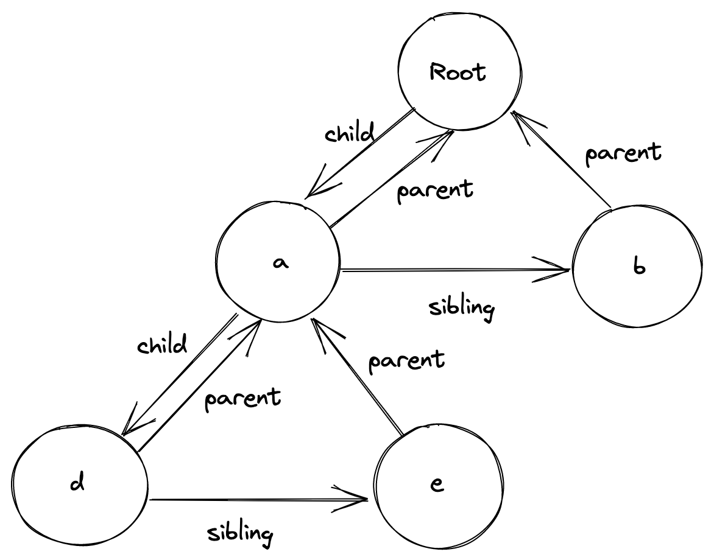

# demo-level-react

# 前言

## What
一个极简版的React，为了帮助自己和他人从代码层面上理解React，而不用花大量时间去翻阅React源码。

## Why
1. 我觉得从别人的极简React代码或自己写一个极简的React是最快的学习React的方式
2. 社区中有不少类似的内容，但我没有找到完全满足我需求的<br>
a. Rodrigo Pombo的[build my own react](https://pomb.us/build-your-own-react/)非常棒，但是内容还是太少了。比如hook的实现不完整，也没有很重要的diff算法、事件系统等。<br>
b. [fre](https://github.com/yisar/fre)这个项目完成度很高，不过它是类React的框架而不是极简的React。说白了就是魔改了太多React的东西，而我想要的是尽可能地掌控React，从而可以避免写bug，快速debug，写出性能更佳，符合React理念的代码——而不是造一个玩具，即使那很酷。<br>


我们的目标：

- [ ]  清晰化vNode的基本结构以及JSX是如何转为vNode的(stage-0)
- [ ]  把vNode树render为真实DOM(stage-1, stage-2)
- [ ]  在上一个的基础上支持更新、删除节点的操作(stage-3,stage-4)
- [ ]  在上一个的基础上支持函数式子组件(stage-5)
- [ ]  在上一个的基础上支持函数式子组件的useState等hooks api(stage-6)
- [ ]  在上一个的基础上支持diff算法（stage-8）
- [ ]  加上调度机制
- [ ]  加上事件系统

# 一切的源头——JSX
JSX是我们开发者给React最主要的输入。
## jsx的分类
JSX可以分为两种：1.组件jsx 2.普通的element jsx。<br>
组件jsx最常见的就是项目根目录里的`<App />`;<br>
普通的element jsx就是`<div id="foo"></div>`这种啦;
## jsx的生命周期
最简洁的表示：jsx -> 函数调用 -> vNode<br>
下面一个一个问题地阐述：
### jsx是怎么变成函数调用的呢？
首先我们的代码都是会经过babel转译的，React的项目中，babel都会配置一个转译jsx插件，这个插件会把我们代码的中jsx都转化为函数调用：

```
// jsx
<div id="foo">
  <a>bar</a>
  <b />
</div>
```

```
// 经过babel处理变为函数调用
React.createElement(
  'div',
  {id: 'foo'},
  React.createElement(
    'a',
    null,
    'bar'
  ),
  React.createElement(
    'b',
    null,
    null
  )
)
```
### 如何转化为函数调用的？
首先阐述转化成的函数是什么的问题，babel会默认转化为React.createElement这个React的内置函数<br>
至于参数，也是babel根据用户书写的jsx通过AST分析获得的，规律大概就是标签名作为第一个参数，所有属性转译成对象作为第二个参数，所有的child以剩余参数的形式进行递归调用。如上图<br>
### 组件jsx的type是怎样的？
我们之前不是说了jsx还有组件jsx吗？那`<App />`这种的第一个参数是什么呢？
这个答案很简单但很重要，这时第一个参数会变成组件函数本身而不再是标签名了。<br>
### createElement函数体是怎样的呢？
实际上，函数体很简单，仅仅将收到的参数整合成一个对象并返回，返回的这个对象就是vNode。只不过需要注意的是，转化函数实际上一共有会生成三种可能的vNode，下面在vNode章节会详细阐述这三种vNode。
### 当遇到Text Element时，babel会如何处理？
对于text element如这个“bar”，不会再开启函数调用把结果作为参数传入，而是直接传入了文本字符串
```
// 最终变为vNode树
{
  type: 'div',
  props: {
    id: 'foo',
    children: [
      {
	type: 'a',
	props: {
	  children: [
	    {
	      type: 'TEXT_ELEMENT',
	      props: {
		  nodeValue: 'bar',
		  children: []
	      }
	    }
	  ]
	}
      },
     {
	type: 'b',
	props: {
		children: []
	}
     }
    ]
  }
}
```
具体的代码见stage-0，你可以自己跑起来看看jsx的转译结果。<br>
另外，我们项目是通过@babel/preset-react这个插件合集来引入了babel用来转译jsx的包，实际上babel会默认转译为React.createElement这个函数调用而不是我们上面示例中写的createVNode这个函数，这也是为什么我们一个tsx文件明明没有显示用到React，但是确必须引入的原因。

不过babel提供了通过注释的方式更改调用的函数名字的机制

```tsx
// 这样我们就可以使用自己定义的方法啦

/** @jsx DemoLevelReact.createVNode */
const element = (
    <div id="foo">
        <App />
        <a>bar</a>
        <b />
    </div>
)
```

# vNode

## vNode分类
之前说的jsx分为两类，而vNode分为三类：
1. 普通的vNode，就是普通的标签，如div标签.特征就是type为标签名
2. 纯文本，如上面例子中a标签中的文本bar.可以看到它是普通jsx的子元素.特征是type为特殊标识TEXT_ELEMENT
3. 函数的vNode，就是函数jsx转化成的vNode.特征是type为组件函数

# 从vNode到fiber

## vNode和fiber的联系与不同？
vNode和fiber都是一个描述UI的树结构的对象，那么为什么有了vNode还需要fiber，它们的区别在哪里呢？<br>
首先vNode这颗树上的UI信息是不全的。比如我们项目中的App是入口，我们的业务jsx都是在App的后代函数里。但是我们这些业务jsx对应的vNode是在根vNode上是没有的，因为这些信息是App组件函数的返回结果，而组件函数是根vNode的type的值。这意味着什么？意味着如果不执行这个type函数，根vNode上就拿不到整颗树上的所有后代。<br>
到这里我们可以得出一个结论，React语境下，vNode树仅仅是某个子树，fiber树才是整个应用的树。

## fiber的结构
每个fiber会维护parent, sibling和child三个亲属fiber，用于遍历树，如图：

这三个属性的获取当然是通过遍历vNode来的。

## fiber的分类
我们之前说了，vNode分为三类（普通标签，纯文本和组件），那么fiber分几类呢？我把fiber分为四类：
1. 组件fiber，和组件vNode对应
2. 纯文本fiber，和纯文本vNode对应
3. 子元素是纯文本的fiber，对应这种vNode: `<div>hello world!</div>`
4. 子元素不只是纯文本的普通fiber：`<div id="foo"><a>bar</a><b /></div>`、

## fiber的建立
这个小节我们已下面代码为例梳理下首次创建过程中fiber树的建立：<br>
```
const App = () => (
  <div id="foo">
      <a>bar</a>
      <b />
  </div>
)
```
fiber当然是根据vNode建立的，在初始时我们仅有`<App />`对应的vNode，我们根据这个vNode，创建了组件fiber，然后执行type函数，得到了组件函数的返回的jsx转译成的vNode，这个vNode通常来说和例子一样是一个普通的vNode(也有可能是fragment或纯文本)。<br>
我们把再基于vNode创建对应类型的fiber，然后把newFiber作为App组件fiber的child.<br>
这一步我们就可以继续处理这个child fiber(即id为foo的div标签对应的fiber)，它的children的第一项是a标签，

## fiber的遍历
fiber的遍历顺序看图就明白了, 用语言描述的话就是先return child，到底了就return sibling，没有sibling了就先找到parent后找return parent的sibling，直到parent也没有了就return null结束。


# 函数式组件
## 最简实现
最简单的函数式组件形如：
```
const Child = () => (
    <div>child</div>
);

const App = () => (
    /** @jsx React.createVNode */
    <div>
        <p>bar</p>
        <Child />
    </div>
);
```
我们先来看看在babel会如何处理函数式组件：
```
// 经过babel处理变为函数调用
React.createVNode(
  'div',
  {},
  React.createVNode(
    'p',
    {},
    'bar'
  ),
  React.createVNode(
    () => /* @__PURE__ */ React.createVNode(
      'div',
      {},
      'child'
    ),
    {},
    []
  )
)
```
可以看到，babel处理函数式组件时，会把组件函数本身作为type参数传入。也就是说，函数式组件时，type字段就不是一个标签的字符串了，而是组件函数本身。
我们也可以维持createNode函数不变，仅仅不过是vNode树中节点的type字段可能是函数而已。<br>
那么fiber树呢？<br>
这里我们的处理是把函数组件本身也作为一个fiber节点，只不过这个节点的dom字段为null，而函数组件返回的vNode，我们还是处理为正常的fiber并且挂到组件fiber的child字段上。<br>
在这个最简例子里，就是Child组件中的div标签对应的fiber会是组件fiber的child。<br>
其实有组件情况下整个fiber树和正常的fiber树基本没什么区别。
我们在处理上的区别只有：<br>
1.处理组件的fiber时，props中是没有children的，需要执行type方法获取到child交由reconcileChildren函数处理<br>
2.组件fiber没有dom，所以在最终创建、更新、删除dom时，parentDom要向上找，删除的dom则要找child
## Hook的实现
### 第一个useState
```
import React, {useState} from './demo-level-react';

const Child = () => {
    const [count, setCount] = useState(0);

    function hanldeClick() {
        setCount(count => count + 1);
    }

    return (
        <div>
            <div onClick={hanldeClick}>点我add count</div>
            {count}
        </div>
    )
}
    
/** @jsx React.createVNode */
const App = () => {
    console.log('根部rerender');
    
    return (
        <div>
            <p>bar</p>
            <Child />
        </div>
    )
}
  
const container = document.querySelector('#root');

container && React.render(<App />, container);
```
我们首先实现这个最简单的useState的case(stage-6)<br>
要实现这个功能，有两个关键点：<br>
1.setState时如何拿到上一次的状态？<br>
2.拿到上一次状态后如何触发更新？<br>
首先第一个问题，我们的答案是把状态放到fiber节点上，用一个数组存储住每一次的状态：
```
export type TAction<T> = (state: T) => T;

export interface IHook<T> {
    state: T;
    queue: TAction<T>[];
}

export interface IFiber<T = any> {
    // 其他无关属性省略
    hooks?: IHook<T>[];
}
```
每次取hooks列表中最新的state就是上次的state<br>
至于如何触发重新渲染，我们之前的渲染就是重新生成wipRoot, 把alternative指向currentRoot, 然后重新生成一遍fiber tree，生成中会和prevFiber做对比，看看是更新还是创建dom。<br>
但这样肯定不是我们想要的，因为的更新维度是整个组件树了，而我们知道React中一个组件中setState只会更新组件子树。<br>
所以我们就重新生成一遍组件子树范围内的fiber tree:<br>
1.我们能在hook内拿到组件的fiber, 那么先把组件fiber的alternative设为自身.这样才能保证是更新而不会创建新的组件<br>
2.通过performUnitOfWork方法生成新的整个子树的fiber，在这个过程中我们会重新执行type方法->重新执行函数式组件->拿到最新的hook state->产生新的vNode->产生带有新dom的fiber<br>
3.最终我们提交组件子树，把fiber转为真实的dom<br>

### useState+useEffect
先上要实现的功能：
```
import React, {useState, useEffect} from './demo-level-react';

const Child = () => {
    const [count, setCount] = useState(0);

    useEffect(() => {
        console.log(count, '[]作为deps的useEffect');
    }, []);

    useEffect(() => {
        console.log(count, 'count改变了呢');
    }, [count]);

    function hanldeClick() {
        setCount(count => count + 1);
    }

    return (
        <div>
            <div onClick={hanldeClick}>点我add count</div>
            {count}
        </div>
    )
}
    
/** @jsx React.createVNode */
const App = () => {
    console.log('根部rerender');
    
    return (
        <div>
            <p>bar</p>
            <Child />
        </div>
    )
}
  
const container = document.querySelector('#root');

container && React.render(<App />, container);
```
在讲解之前我们抛出一个问题：为什么React Hooks中会有不能if这种语句的限制？<br>
下面我会从代码实现角度回答下这个问题：<br>
因为我们的hooks是挂在函数组件fiber上的，hooks的语义就是hook list, 数组项就是一个hook比如useState或者useEffect.<br>
我们要保证的一点是，每次渲染hooks列表中的元素个数和顺序是相同的。<br>
为什么要保证个数和顺序相同，因为这样实现起来简单呀（不要忽略了简单，简单合理比好用更重要）<br>
下面具体说下为什么简单：<br>
1.首次渲染的时候，我们把全局的hookIndex置为0.<br>
2.创建第一个hook useState的实例，其实就是一个state: 0和一个actions: [].actions代表要被执行的动作列表，初始为空，当执行了setState方法时才会往actions中push，然后下次渲染时才flush这个列表执行所有action，计算出最新的state然后返回给函数式组件.<br>
3.在这之后我们会把useState的hook实例push到comp fiber的hooks中<br>
4.创建第二个hook useEffect的实例，其实就是一个deps: deps, 首先首次渲染我们会执行一次effect，之后我们会比对本次传入的deps和上次渲染的deps中的元素是否有任何变更，有任何变更都会执行effect函数.<br>
5.然后我们会把useEffect的实例push到comp fiber的hooks中，并且结束第一次渲染来到关键的第二次渲染.<br>
6.第二次渲染先来到useState钩子，我们要拿到上次渲染的hook实例，并且取到actions变量来遍历得出新的state.我们只需要取上次的comp fiber的hooks[hookIndex]就可以了，因为我们约定了每次渲染的hook的数目和顺序。<br>
7.然后我们就只需要hookIndex++就能让下次hooks[hookIndex]取到下个钩子，无论是prev comp fiber的hooks[hookIndex]还是cur comp fiber的hooks[hookIndex]，取的都一定是同一个钩子的hook state，能基于上次状态继续work.<br>
8.来到useEffect钩子，我们会比较cur comp fiber的hooks[hookIndex].deps本次传入得deps的差异，有差就执行effect.<br>
9.最后我们所有hook执行完毕，new fiber生成完毕，compTree也commit完毕后会重置函数组件的hookIndex，然后下次冲渲染的时候再从头到尾遍历。<br>

总结一下重点，**因为hook的功能一定要获取上次渲染的hook state(如useEffect要上次的deps)，而保证了组件的hooks数目和顺序一致，那获取prev comp fiber的对应hook的逻辑就简单了，只需要一个自增的hookIndex就能能拿到上次的hook state.**


### pause and think: 我们每次setState的时候，是如何触发更新的？

首先，我们在创建/更新函数组件fiber后会把currentFiber这个全局变量置为函数组件的fiber，然后会执行函数式组件，执行函数组件后就会执行其中的useState等钩子，useState内部的getHook会从currentFiber这个全局变量上获取到函数式组件的fiber。
基于以上，其实我们useState钩子内永远是永远可以拿到最新的组件fiber的。而有了组件的fiber，更新就很容易理解了，其实不就是setState的时候传入一个新的state，然后基于这个新的state reconcile组件就是了。<br>
这也回答了一个面试问题:
```
const [count, setCount] = useState(0);
useEffect(() => {
  // 在window上绑定window.setCount = setCount，调用window.setCount(count => count + 1)能否更新组件让count+1
  // 多次调用也会累加吗呢？
  // @ts-ignore
  window.setCount = setCount;
}, []);
```
是可以的，多次也都可以成功累加。有人可能疑惑：window上的setCount函数是第一次生成的，而不是最新生成的。setState传入的是一个oldState=>newState的计算，更新需要新状态和当前组件fiber两个条件。也就是说setCount需要获取到最新的last state和最新的组件fiber才能正确更新，但是旧的setCount函数可以获取到这两个新值吗？其实是可以的，那么我们就好奇React是如何做到自动更新这两个的呢？<br>
我们先用一个最简模型给大家看看，然后再分析原因：

```
const compFiber = {
  hook: []
}

const getHook = () => {
  return [compFiber.hook, compFiber];
}

const useState = initialState => {
  const [hook, compFiber] = getHook();
  return [
    hook.length === 0 ? (hook[0] = initialState) : hook[0],
    fn => {
      console.log('看看能否获取到最新的last state:', hook[0]);
      hook[0] = fn(hook[0]);
    }
  ]
}

const [count1, oldSetCount] = useState(0);

// 会得到最新的last state
oldSetCount(count => count + 1)

// setState后一定会再次执行函数式组件，所以会再次执行useState
const [count2, newSetCount] = useState(0);

// 即使调用旧的setState仍会得到最新的last state
oldSetCount(count => count + 1)
```
好了，把这段代码copy到浏览器我们是能看到两次调用oldSetCount还是会得到最新的oldState的。
看了代码基础及格的同学就明白了，我们在setState引用的hook是一直都存在的一块内存，而每次setCount就是更新这块内存，而再次调用还是读这块内存，所以自然能获取到最新的last state。内存这个我再补充下，只要不手动清理或者还有变量引用，内存空间就一直存在，读取变量时获取的自然是这块内存上的最新值。